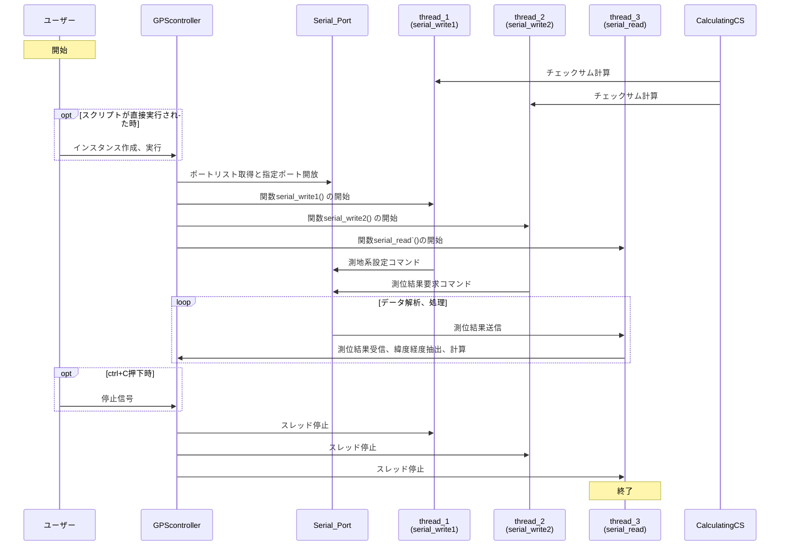

```mermaid
sequenceDiagram
    Note over User:開始
    participant User as ユーザー
    participant Ger as GPScontroller
    participant SP as Serial_Port
    participant th1 as thread_1<br>(serial_write1)
    participant th2 as thread_2<br>(serial_write2)
    participant th3 as thread_3<br>(serial_read)
    participant cs as CalculatingCS
    %%participant=参加者

    cs->>th1:チェックサム計算
    cs->>th2:チェックサム計算
    opt スクリプトが直接実行された時
        User->>Ger: インスタンス作成、実行
    end
    Ger->>SP: ポートリスト取得と指定ポート開放
    Ger->>th1: 関数serial_write1() の開始
    Ger->>th2: 関数serial_write2() の開始
    Ger->>th3: 関数serial_read`()の開始

    th1->>SP: 測地系設定コマンド
    th2->>SP: 測位結果要求コマンド
    loop データ解析、処理
        SP->>th3: 測位結果送信
        th3->>Ger: 測位結果受信、緯度経度抽出、計算
    end

    opt ctrl+C押下時
        User->>Ger: 停止信号
    end
    Ger->>th1: スレッド停止
    Ger->>th2: スレッド停止
    Ger->>th3: スレッド停止
    Note over th3:終了
```