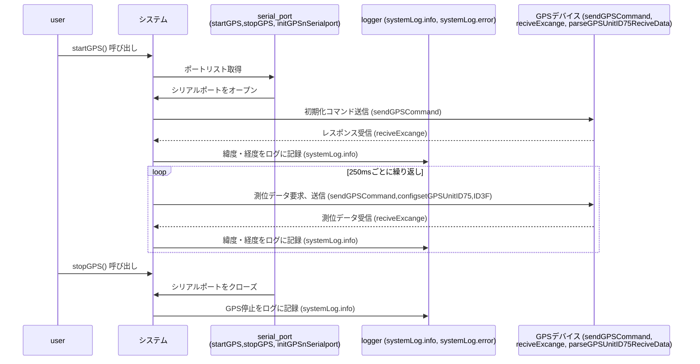

```mermaid
sequenceDiagram
    participant use as user
    participant Sys as システム
    participant sp as serial_port <br>(startGPS,stopGPS, initGPSnSerialport)
    participant log as logger (systemLog.info, systemLog.error)
    participant dev as GPSデバイス (sendGPSCommand, <br>reciveExcange, parseGPSUnitID75ReciveData)

    use ->> Sys: startGPS() 呼び出し
    Sys->>sp:ポートリスト取得
    sp ->> Sys: シリアルポートをオープン
    Sys ->> dev: 初期化コマンド送信 (sendGPSCommand)
    dev -->> Sys: レスポンス受信 (reciveExcange)
    Sys ->> log: 緯度・経度をログに記録 (systemLog.info)

    loop 250msごとに繰り返し
        Sys ->> dev: 測位データ要求、送信 (sendGPSCommand,configsetGPSUnitID75,ID3F)
        dev -->> Sys: 測位データ受信 (reciveExcange)
        Sys ->> log: 緯度・経度をログに記録 (systemLog.info)
    end

    use ->> Sys: stopGPS() 呼び出し
    sp ->> Sys: シリアルポートをクローズ
    Sys ->> log: GPS停止をログに記録 (systemLog.info)

```